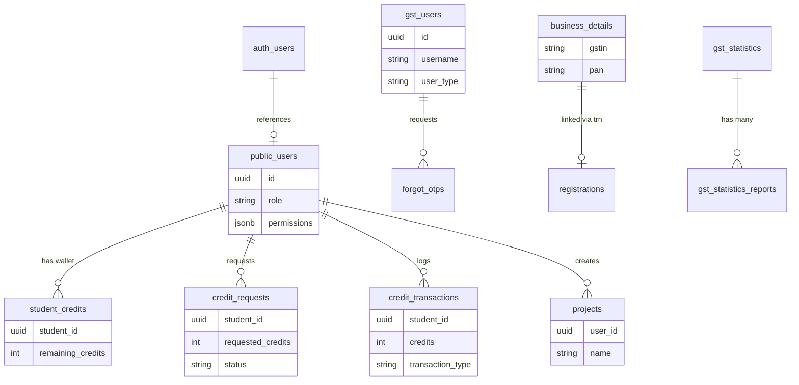

# COMPLETE DATABASE SCHEMA DOCUMENTATION

## 1. Executive Summary

This document provides a comprehensive analysis of the database schema, architecture, and application mapping for both **Project A (GST Self Learning App)** and **Project B (dbiz-CRM App)**. The analysis spans both frontend and backend codebases, capturing the dual Supabase configurations discovered across the projects.

**Project Setup Discovery:**
* **Project A (GST App)**: Serves as a tax learning and processing platform. Connects to its own Supabase instance. Highly reliant on fallback/mocking logic if Supabase is unavailable.
* **Project B (CRM App)**: Serves as a student credit management and super-admin CRM platform. Uses its own Supabase instance (`supabaseAdmin`) to manage user credits, requests, projects, and permissions.
* While they operate independently, they share common architectural patterns such as Node.js Express controllers mapped to specific frontend React routes.

## 2. All Tables Discovered

### Project A (GST App)
| Table Name | Purpose | Row Count |
| --- | --- | --- |
| `users` | Core authentication and taxpayer profiling | Unknown |
| `forgot_otps` | Temporary storage for password reset OTPs | Unknown |
| `business_details` | Taxpayer details, GSTIN profiles | Unknown |
| `registrations` | New taxpayer application workflows | Unknown |
| `gst_statistics` | Financial year aggregate statistics | Unknown |
| `gst_statistics_reports` | Downloadable statistic PDF/Excel files | Unknown |
| `taxpayer_temporary_ids` | Profiles for taxpayers with Temporary IDs | Unknown |
| `composition_taxpayers` | Profiles of Opted-in/Opted-out taxpayers | Unknown |
| *(Refer to original GST docs for all 20+ GSTR return tables)* | | |

### Project B (CRM App)
| Table Name | Purpose | Row Count |
| --- | --- | --- |
| `public.users` | CRM users, roles, statuses, and permissions | Unknown |
| `student_credits` | Tracks total, used, and remaining credits per student | Unknown |
| `credit_requests` | Tracks student requests for more credits | Unknown |
| `credit_transactions` | Audit log of credit additions, deductions, and approvals | Unknown |
| `projects` | User projects/items created via the CRM | Unknown |

## 3. All Columns

### Project A (GST App)
*(Inferred from application usage and mappings)*

**Table: users**
| Column | Type | PK | FK | Nullable | Default | Description |
| --- | --- | --- | --- | --- | --- | --- |
| `id` | uuid/int | Yes | No | No | - | Primary identifier |
| `username` | text | No | No | No | - | Login credential |
| `password` | text | No | No | No | - | Hashed credential |
| `user_type`| text | No | No | Yes | - | e.g. 'Taxpayer' |

**Table: business_details**
| Column | Type | PK | FK | Nullable | Default | Description |
| --- | --- | --- | --- | --- | --- | --- |
| `id` | uuid/int | Yes | No | No | - | Identifier |
| `gstin` | text | No | No | No | - | 15-char ID |
| `pan` | text | No | No | No | - | 10-char ID |
| `legal_name` | text | No | No | No | - | Official Name |
| `state` | text | No | No | Yes | - | Location |
| `gst_status`| text | No | No | No | - | Active/Cancelled |

### Project B (CRM App)
*(Extracted from SQL definition files)*

**Table: public.users**
| Column | Type | PK | FK | Nullable | Default | Description |
| --- | --- | --- | --- | --- | --- | --- |
| `id` | uuid | Yes | No | No | gen_random_uuid() | Auth reference |
| `username` | text | No | No | No | - | Email / Username |
| `password_hash` | text | No | No | No | - | Encrypted hash |
| `role` | text | No | No | No | 'user' | student, admin, superadmin |
| `status` | text | No | No | No | 'active' | active / inactive |
| `permissions` | jsonb | No | No | Yes | JSON string | Module access |
| `created_at` | timestamp | No | No | No | now() | Creation date |

**Table: student_credits**
| Column | Type | PK | FK | Nullable | Default | Description |
| --- | --- | --- | --- | --- | --- | --- |
| `id` | uuid | Yes | No | No | gen_random_uuid() | ID |
| `student_id` | uuid | No | Yes| No | - | Matches public.users.id |
| `total_credits`| int | No | No | Yes | 0 | Lifetime granted credits |
| `used_credits` | int | No | No | Yes | 0 | Burned credits |
| `remaining_credits`| int | No | No | Yes | 0 | Current balance |
| `created_at` | timestamp | No | No | No | now() | Date created |
| `updated_at` | timestamp | No | No | No | now() | Last update |

**Table: credit_requests**
| Column | Type | PK | FK | Nullable | Default | Description |
| --- | --- | --- | --- | --- | --- | --- |
| `id` | uuid | Yes | No | No | gen_random_uuid() | ID |
| `student_id` | uuid | No | Yes| No | - | Matches public.users.id |
| `requested_credits`| int| No | No | No | - | Requested amount |
| `reason` | text | No | No | No | - | Justification |
| `status` | text | No | No | Yes | 'pending' | pending/approved/rejected |
| `approved_by` | uuid | No | Yes| Yes | - | Admin ID who approved |
| `created_at` | timestamp | No | No | No | now() | Date requested |

**Table: credit_transactions**
| Column | Type | PK | FK | Nullable | Default | Description |
| --- | --- | --- | --- | --- | --- | --- |
| `id` | uuid | Yes | No | No | gen_random_uuid() | ID |
| `student_id` | uuid | No | Yes| No | - | Matches public.users.id |
| `transaction_type` | text | No | No | No | - | Event type (burn, add) |
| `credits` | int | No | No | No | - | Quantity |
| `balance_after` | int | No | No | No | - | Resulting balance |
| `created_by` | uuid | No | Yes| Yes | - | Admin or student |
| `created_at` | timestamp | No | No | No | now() | Event timestamp |

**Table: projects**
| Column | Type | PK | FK | Nullable | Default | Description |
| --- | --- | --- | --- | --- | --- | --- |
| `id` | uuid | Yes | No | No | - | ID |
| `user_id` | uuid | No | Yes| No | - | Matches public.users.id |
| `name` | text | No | No | No | - | Item name |
| `description` | text | No | No | Yes | - | Description |
| `status` | text | No | No | Yes | - | e.g. active |

## 4. Relationships

### Project A (GST App)
* `business_details.trn` → `registrations.trn` → 1:1 Linkage
* `users.username` → `forgot_otps.username` → 1:1 Linkage

### Project B (CRM App)
* `public.users.id` → `student_credits.student_id` → 1:1 (User to Wallet)
* `public.users.id` → `credit_requests.student_id` → 1:N (User to Requests)
* `public.users.id` → `credit_requests.approved_by` → 1:N (Admin to Approvals)
* `public.users.id` → `credit_transactions.student_id` → 1:N (User to Tx Logs)
* `public.users.id` → `projects.user_id` → 1:N (User to Projects)

## 5. Auth Structure

**Project A (GST App):**
* Uses a custom authentication table (`users`). 
* Checks credentials manually with custom bcrypt. Does not use `auth.users` directly in backend.

**Project B (CRM App):**
* Implements direct Supabase `auth.users` integration.
* `POST /api/auth/login` uses `supabase.auth.signInWithPassword()`.
* Maps `auth.users.id` to a secondary `public.users` table (`select * from users where id = user.id`) to fetch role and JSONB permissions.
* Supports role-based access: `superadmin`, `admin`, `student`, `manager`, `institute`.
* Validates user `status === 'active'`.

## 6. Storage Structure

* No active Supabase storage buckets detected in either project. GST App references external URLs, and CRM App does not handle file uploads in the current codebase.

## 7. RLS Policies

### Project A (GST App)
* Assumed handled via standard Anon/Service Key logic. No specific RLS policies exported.

### Project B (CRM App)
**Table: public.users**
* `Allow public select for validation` (SELECT) -> `USING (true)`
* `Allow service_role full control` (ALL) -> `TO service_role USING (true)`

**Table: student_credits, credit_requests, credit_transactions**
* `Allow public select on [table]` (SELECT) -> `USING (true)`
* `Allow service_role full control on [table]` (ALL) -> `TO service_role USING (true)`

## 8. Functions
* No stored procedures discovered in the exported SQL schemas. Backend controllers handle data aggregation.

## 9. Triggers
* No custom PostgreSQL triggers detected.

## 10. Views
* No SQL views detected.

## 11. API Mapping

### Project A (GST App)
| Endpoint | Controller | Target Tables |
| --- | --- | --- |
| `POST /api/auth/login` | `auth.js` | `users` |
| `GET /api/gst-statistics` | `gstStatistics.js`| `gst_statistics` |
| `GET /api/search-taxpayer/:gstin`| `searchTaxpayer.js`| `business_details` |
| *(Other routes mapped in existing documentation)*| | |

### Project B (CRM App)
| Endpoint | Controller | Target Tables |
| --- | --- | --- |
| `POST /api/auth/login` | `authController.js` | `auth.users`, `public.users` |
| `GET /api/student/credits` | `creditsController.js`| `student_credits`, `credit_transactions` |
| `POST /api/student/credits/request` | `creditsController.js`| `credit_requests` |
| `POST /api/student/credits/burn`| `creditsController.js`| `student_credits`, `credit_transactions` |
| `GET /api/superadmin/credit-requests`| `creditsController.js`| `credit_requests`, `users`, `student_credits`|
| `POST /api/items` | `itemController.js` | `projects` |

## 12. Frontend Mapping

*(General conceptual mapping based on endpoints)*
| Page Name | API Used | Tables Used |
| --- | --- | --- |
| (GST) Dashboard | `/api/search-taxpayer/:gstin` | `business_details` |
| (CRM) Student Dashboard | `/api/student/credits` | `student_credits` |
| (CRM) Request Credits | `/api/student/credits/request`| `credit_requests` |
| (CRM) Admin Approvals | `/api/superadmin/credit-requests`| `credit_requests`, `users` |
| (CRM) Items / Projects | `/api/items` | `projects` |

## 13. Duplicate Analysis

**Comparison of Project A and Project B:**
* **Duplicate Tables**: Both apps use a table named `users`. However, their structures differ wildly. Project B's `users` relies on Supabase Auth UUIDs, whereas Project A's `users` table handles direct password hashing.
* **Duplicate Columns**: Common columns like `id` and `created_at` exist, but no functional duplication of business columns.
* **Architecture**: The two projects serve entirely different domain logic. Project A is an offline-capable mockable learning app. Project B is a strict credit-ledger and CRM platform relying heavily on Supabase RLS and Auth.

## 14. Merge Recommendations

To merge both into a single Supabase project safely:
1. **Schema Separation**: Do not merge the `users` tables directly. Rename Project A's `users` table to `gst_users` or move it to a specific schema (e.g., `schema: gst`).
2. **Auth Unification**: If the goal is SSO, migrate Project A's users into `auth.users` using Supabase's admin APIs, generating new UUIDs, and map them to the unified `public.users` table with `role: 'taxpayer'`.
3. **Credit System Isolation**: Keep `student_credits`, `credit_transactions`, and `credit_requests` tied exclusively to `public.users.id`.
4. **Namespace Management**: Ensure all GST tables (e.g., `business_details`, `gst_statistics`) do not share names with any CRM entities.

## 15. Final ER Diagram

